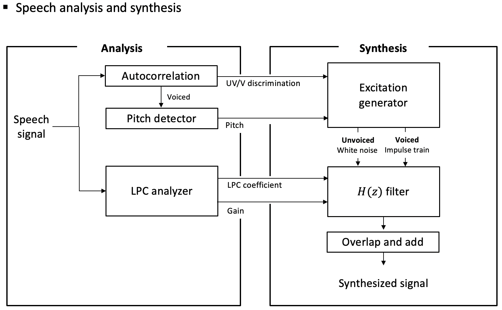
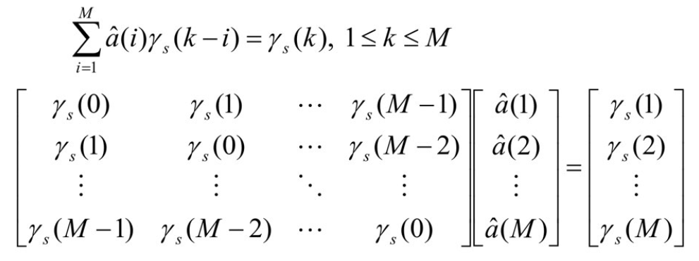

# LPC_Speech_Synthesis
### - Predict current sample value from past p samples 

### - Useful for compression or transmission by encoding only residual and linear prediction coefficients

# Overview

# Speech Analysis
### - Get unvoiced/voiced flag information, LPC coefficients, and detect pitch
    Speech_analysis.ipynb

## *Vocal tract modelling (AR modelling)

### Autocorrelation Method

# Speech Synthesis
#### - Synthesize speech using LPC information and excitation
    Speech_synthesis.ipynb

